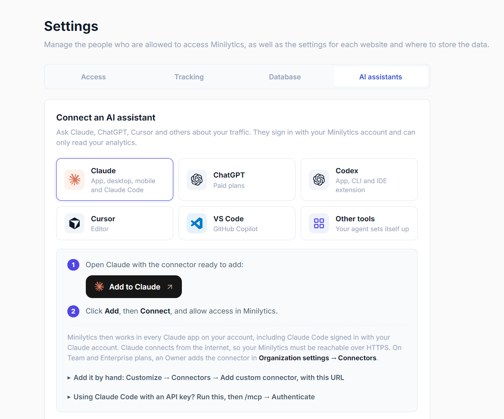

# AI assistants (MCP)

Minilytics includes an [MCP](https://modelcontextprotocol.io) server, so an AI assistant can answer questions such as "Where did last week's visitors come from?" from your own data. Assistants sign in with your Minilytics account and get read-only access: you never copy a password or a token into them.

**Settings → AI assistants** walks you through it: pick your assistant to get its setup steps, with one-click buttons for Claude, Cursor and VS Code, and a prompt that lets any other agent configure itself. The **Authorized access** list there shows every assistant that can read your analytics.



## Server URL

The MCP server is `https://<your-instance>/mcp.php`, for example `https://analytics.example.com/mcp.php`. It uses the Streamable HTTP transport. Assistants reach it from the internet, so the instance must be served over HTTPS.

## How sign-in works

The first time an assistant calls the server, Minilytics answers that it needs authorization and where to find it. The assistant then registers itself, opens a Minilytics page in your browser, and asks you to allow access. Once you click **Allow access**, it receives a token that:

- is **read-only**: it reads the statistics of every website, like a member account, but never creates, changes or deletes anything, and cannot open the dashboard or manage users;
- only works on the MCP server, not on the other endpoints;
- belongs to your account, and stops working when you revoke it under **Authorized access** or when your account is deleted.

This is the OAuth 2.1 flow of the [MCP authorization specification](https://modelcontextprotocol.io/specification/2025-11-25/basic/authorization), with PKCE and dynamic client registration. Minilytics is its own authorization server, so there is nothing to configure.

## Add Minilytics to your assistant

The examples below use `https://analytics.example.com/mcp.php`: replace it with your own server URL, or copy the ready-made commands from **Settings → AI assistants**.

### Claude (app, desktop, mobile and Claude Code)

1. Click **Add to Claude** in **Settings → AI assistants**. It opens Claude with the **Add custom connector** dialog already filled in. To do it by hand, open **Customize → Connectors → Add custom connector**, name it **Minilytics** and paste the server URL.
2. Click **Add**, then **Connect**, and allow access in Minilytics.

The connector then works in every Claude app on your account: claude.ai, the desktop and mobile apps, and Claude Code when it is signed in with your Claude account. On Team and Enterprise plans, an Owner adds the connector in **Organization settings → Connectors**, then each member connects.

Claude connects to Minilytics from the internet, so this only works with an instance served over HTTPS. If you use Claude Code with an API key instead of a Claude account, add the server from the terminal:

```bash
claude mcp add --transport http minilytics https://analytics.example.com/mcp.php
```

Then run `/mcp` in Claude Code, select **minilytics** and choose **Authenticate**.

### ChatGPT

1. In **Settings → Apps → Advanced settings**, turn on **Developer mode**. It requires a paid plan, and on Business or Enterprise plans an admin may need to allow custom apps.
2. Click **Create app**, name it **Minilytics**, choose **OAuth** and paste the server URL.
3. Click **Create**, then allow access in Minilytics. In a chat, turn the app on from the **+** menu.

### Codex

1. In Codex, open **Settings → MCP** and add a custom MCP server.
2. Name it **minilytics**, choose **Streamable HTTP** and paste the server URL.
3. Click **Save**, then **Authenticate**, and allow access in Minilytics.

With the Codex CLI, run instead:

```bash
codex mcp add minilytics --url https://analytics.example.com/mcp.php
codex mcp login minilytics
```

The Codex app, CLI and IDE extension share this configuration.

### Cursor

1. Click **Add to Cursor** in **Settings → AI assistants**, or add the server to `~/.cursor/mcp.json`:

   ```json
   {
     "mcpServers": {
       "minilytics": { "url": "https://analytics.example.com/mcp.php" }
     }
   }
   ```

2. In Cursor's MCP settings, click **Connect** next to minilytics, then allow access in Minilytics.

### VS Code (GitHub Copilot)

1. Click **Add to VS Code** in **Settings → AI assistants**, or run:

   ```bash
   code --add-mcp '{"name":"minilytics","type":"http","url":"https://analytics.example.com/mcp.php"}'
   ```

2. When VS Code starts the server, sign in to Minilytics and allow access.

### Other tools

For Gemini CLI, Windsurf, Antigravity or any other agent, the simplest way is to let the agent set itself up: **Settings → AI assistants → Other tools** gives a prompt to paste into it. The prompt gives the server name, URL and transport, tells the agent to rely on the sign-in rather than add a token, and to ask you for an [access token](#access-tokens) if it cannot sign in.

You can also add the server URL to the assistant's MCP settings yourself. Most assistants sign in by themselves once the URL is added. Windsurf and Antigravity name the field `serverUrl` instead of `url`.

Some Antigravity versions finish signing in but still call the server without the token and fail with `Unauthorized` ([antigravity-cli#25](https://github.com/google-antigravity/antigravity-cli/issues/25)). Use an access token with it until this is fixed.

## Authorized access

**Settings → AI assistants → Authorized access** lists the assistants you connected and your access tokens, with when each was connected or created and last used. Revoking one cuts its access immediately; the assistant has to be connected again to read your analytics.

## Tools

| Tool | Returns |
| --- | --- |
| `list_sites` | The tracked websites and their `site_id`. |
| `get_overview` | Visitors, visits, pageviews, events, bounce rate, average visit duration, live visitors, and the change since the previous period. |
| `get_timeseries` | Traffic per hour, day or week. |
| `get_top_pages` | Most viewed pages. |
| `get_top_referrers` | Websites sending traffic. |
| `get_top_events` | Custom events. |
| `get_countries` | Visitors per country. |
| `get_environment` | Visitors per browser, operating system or device. |
| `get_acquisition` | Visits per channel, source, UTM parameter, landing page or exit page. |

Every tool except `list_sites` accepts:

- `site_id`, optional when the instance tracks a single website;
- `range`: `today`, `24h`, `7d` (default), `30d`, `90d`, `6m`, `all`, or `custom` with `from` and `to` (`YYYY-MM-DD`, UTC);
- `filters`: the dashboard filters, as lists of values per dimension (`page`, `referrer`, `browser`, `os`, `device`, `country`). For example, `{"page": ["/pricing"]}` only counts visits that viewed `/pricing`.

## Access tokens

Access tokens are for assistants that cannot sign in through OAuth, such as agents running without a browser. Create one in **Settings → AI assistants → Other tools**, under **Assistant can’t sign in?**, and copy it right away: Minilytics only stores a hash and cannot show it again. Like OAuth tokens, access tokens are read-only, only work on the MCP server, belong to your account and stop working when you revoke them.

Send the token in an `Authorization: Bearer` header, with a remote server configuration such as the one below (Windsurf and Antigravity use `serverUrl` instead of `url`). Revoke it under **Authorized access** when you no longer need it.

```json
{
  "mcpServers": {
    "minilytics": {
      "type": "http",
      "url": "https://analytics.example.com/mcp.php",
      "headers": { "Authorization": "Bearer mlt_your_token" }
    }
  }
}
```

The endpoints used by the dashboard do not accept tokens: they only serve the signed-in dashboard, and their format may change between releases.

## Web server

The sign-in metadata is served by PHP files under `/.well-known/`, and every request carries an `Authorization` header that must reach PHP:

- **Apache and LiteSpeed**: the bundled `.htaccess` handles both.
- **Nginx**: the configuration in [operations](../operations/README.md#nginx) already serves `/.well-known/` and passes the header.
- **Caddy**: use the `@blocked` matcher from [operations](../operations/README.md#caddy), which keeps `/.well-known/` reachable.

## Troubleshooting

- **The assistant stops with `Unauthorized` and never opens a sign-in page**: it does not support OAuth for remote MCP servers, or not reliably. Use an [access token](#access-tokens) in an `Authorization: Bearer` header.
- **No assistant can sign in**: open `https://<your-instance>/.well-known/oauth-protected-resource/mcp.php`. It should return a JSON document whose `resource` is your server URL, and `https://<your-instance>/.well-known/oauth-authorization-server/mcp.php` should return the sign-in endpoints. Behind a reverse proxy that terminates HTTPS, forward the `X-Forwarded-Proto` header so these URLs use `https`.

The authorization server's issuer is `https://<your-instance>/mcp.php`, so its metadata lives at `/.well-known/oauth-authorization-server/mcp.php`, as [RFC 8414](https://www.rfc-editor.org/rfc/rfc8414#section-3.1) derives it from the issuer. Nothing is served at `/.well-known/oauth-authorization-server` itself, and that is expected: clients find the issuer through the protected resource metadata first.

See also: [operations](../operations/README.md), [documentation index](../README.md).
