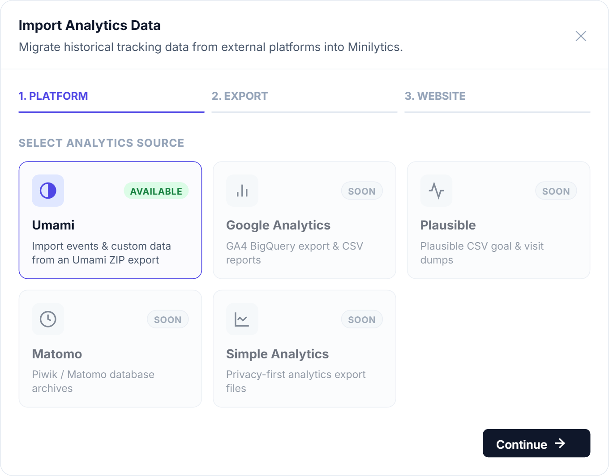

# Importing from another analytics service

Moving from another analytics tool? Import your past data so you keep your history.

- [x] Umami
- [ ] Google Analytics (planned)
- [ ] Plausible (planned)
- [ ] Matomo (planned)
- [ ] Simple Analytics (planned)

> Your service is not supported yet? Contributions of new importers are very welcome on [GitHub](https://github.com/axthauvin/minilytics).

## From the dashboard

1. Export your data from Umami as a ZIP file.
2. In Minilytics, click **Import Data** and choose Umami.
3. Upload the ZIP file, then choose an existing website or create a new one for this data.



Very large exports may exceed your server's upload limit. In that case, raise the limit as explained in [Operations](../operations/README.md#large-imports), or use the command line below.

## From the command line

If you can open a terminal on your server, run this command from the Minilytics folder.

```bash
php bin/import.php --zip umami-export.zip --site-id my_site
```

Replace `my_site` with the identifier of the website that receives the data. Run `php bin/import.php --help` to see every option.
