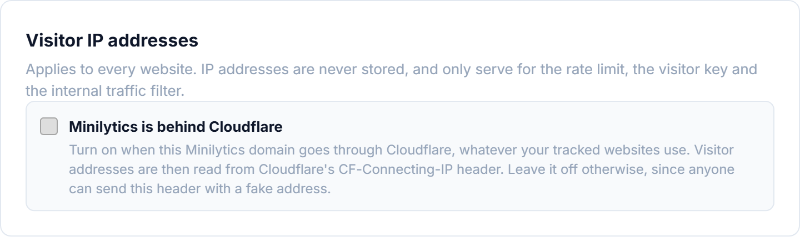
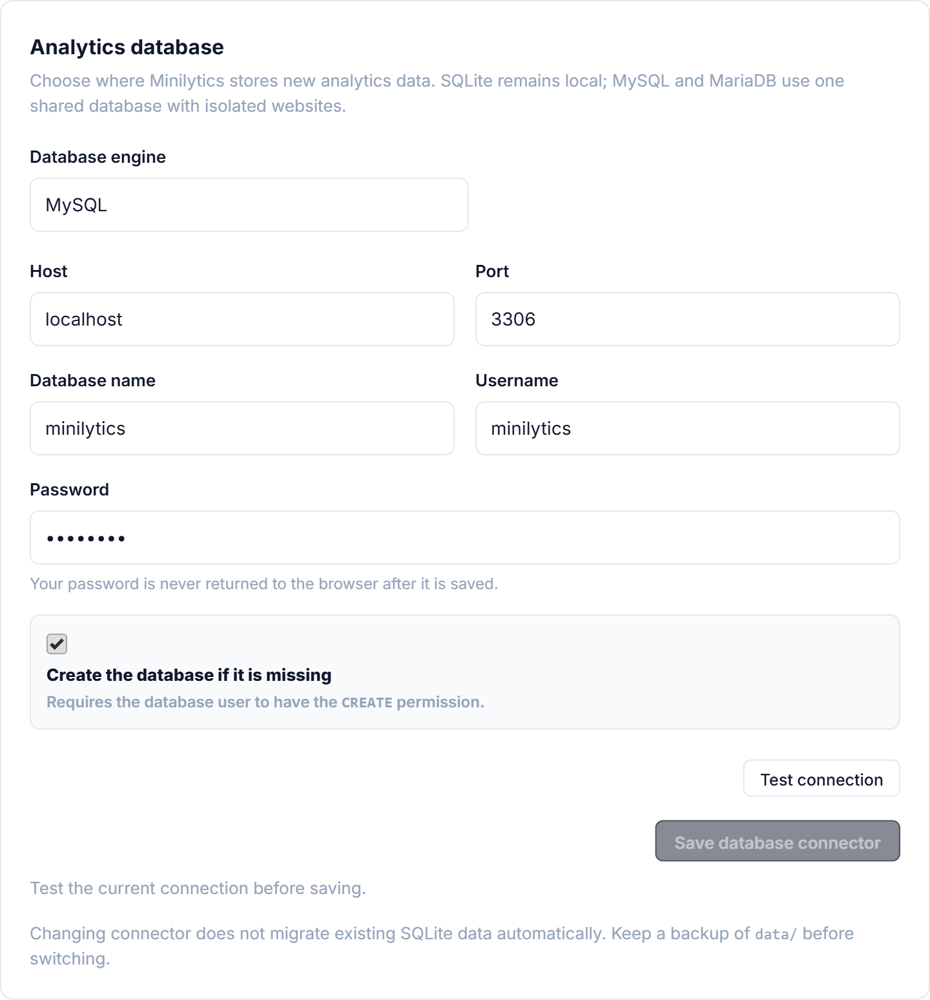
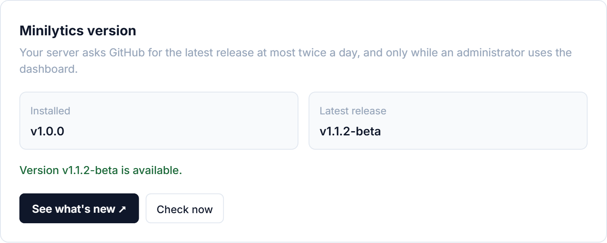

# Operations and storage

## Accounts

The first time you open the dashboard, you create the administrator account. Nobody else can sign up on their own.

To give someone access, open **Settings → Access** and click **Create invitation link**. Each link works once and expires after seven days.


## Where your data is stored

Minilytics keeps its data in a `minilytics-data` folder next to your website's folder, out of reach from the web. To use another folder, set the `MINILYTICS_DATA_DIR` environment variable on your server.

By default, each website gets its own small database file, with nothing to install. You can also store your analytics in a MySQL or MariaDB database, as explained [below](#using-mysql-or-mariadb).

Visits are kept for 13 months by default. You can choose another duration for each website in **Settings → Tracking**.

## Web server configuration

On Apache and LiteSpeed, which most shared hosting providers use, there is nothing to set up. Minilytics comes with the right rules.

Nginx and Caddy need a few lines of configuration to keep the private files of Minilytics hidden and to accept large imports. When these rules are missing, the dashboard shows a warning to administrators.

### Nginx

```nginx
server {
    listen 80;
    server_name analytics.example.com;
    root /var/www/minilytics;
    index index.html index.php;

    # Data imports upload ZIP archives of up to 128 MB.
    client_max_body_size 128M;

    # Application code, Composer files, databases and dotfiles are never served.
    location ~ ^/(vendor|src|bin|tests)(/|$) { return 403; }
    location ~ \.(db|db-wal|db-shm|json|lock)$ { return 403; }
    location ~ /\.(?!well-known/) { return 403; }

    location = /minilytics.js {
        add_header Cache-Control "no-cache, must-revalidate";
    }

    location / {
        try_files $uri $uri/ =404;
    }

    location ~ \.php$ {
        try_files $uri =404;
        include fastcgi_params;
        fastcgi_param SCRIPT_FILENAME $document_root$fastcgi_script_name;
        fastcgi_pass unix:/run/php/php8.3-fpm.sock;
    }
}
```

Replace the `fastcgi_pass` address with the one of your PHP service, and keep the `return 403` lines above the `\.php$` block.

### Caddy

```caddy
analytics.example.com {
    root * /var/www/minilytics
    encode gzip

    # Application code, Composer files, databases and dotfiles are never served.
    # /.well-known/ stays reachable for AI assistants to sign in.
    @blocked {
        path_regexp ^/(vendor|src|bin|tests)(/|$)|\.(db|db-wal|db-shm|json|lock)$|/\.
        not path /.well-known/*
    }
    respond @blocked 403

    header /minilytics.js Cache-Control "no-cache, must-revalidate"

    # Data imports upload ZIP archives of up to 128 MB.
    request_body {
        max_size 128MB
    }

    # Serve index.html before index.php at the site root.
    php_fastcgi unix//run/php/php8.3-fpm.sock {
        try_files {path} {path}/index.html {path}/index.php
    }
    file_server
}
```

### Large imports

To import large exports with Nginx or Caddy, also raise these limits in your PHP settings (`php.ini`).

```ini
upload_max_filesize = 128M
post_max_size = 128M
memory_limit = 256M
max_execution_time = 300
max_input_time = 300
```

### Behind Cloudflare

If the domain where Minilytics runs goes through Cloudflare, turn on **Minilytics is behind Cloudflare** in **Settings → Tracking**. Without it, all your visitors seem to come from the same place, which mixes up visitors and countries. The dashboard suggests it when it notices Cloudflare.



Only the domain of Minilytics matters here. Whether the websites you track use Cloudflare makes no difference.

Leave this option off if you do not use Cloudflare, and when it is on, make sure your server only accepts traffic coming through Cloudflare.

## Using MySQL or MariaDB

The default storage suits most websites. To use MySQL or MariaDB instead, follow these steps.

1. At your hosting provider, create a database and a user for Minilytics.
2. In Minilytics, go to **Settings → Database**, choose MySQL or MariaDB and enter these details.
3. Click **Test connection**, then **Save database connector**.



Your PHP installation needs the `pdo_mysql` extension, which most hosting providers enable. Analytics already collected are not moved to the new database, so [back them up](#backups) before switching.

## Updates

**Settings → Updates** shows the version you use and tells you when a new one is available. A small dot also appears next to **Settings** when it is time to update.



Updating from the dashboard is not possible yet. To update, download the latest archive and extract it over your current installation, just like when you installed Minilytics. Run these commands in the folder where Minilytics is installed.

```bash
curl -LO https://github.com/axthauvin/minilytics/releases/latest/download/minilytics.tar.gz
tar -xzf minilytics.tar.gz && rm minilytics.tar.gz
```

Without a terminal, download `minilytics.tar.gz` from the [latest release](https://github.com/axthauvin/minilytics/releases/latest), extract it on your computer, and upload its files over the old ones with your hosting provider's file manager or FTP.

Your analytics, accounts and settings are kept, because they live in the data folder, outside the files you replace. If you edited the `.htaccess` file, save your changes first, since the archive replaces it.

## Backups

To back up your analytics regularly, schedule this command on your server.

```bash
php bin/backup.php --destination /secure/backups/minilytics
```

Keep the backups on another disk or machine, so that a disk failure does not take them with your data. If you use MySQL or MariaDB, use the database backups of your hosting provider instead.
