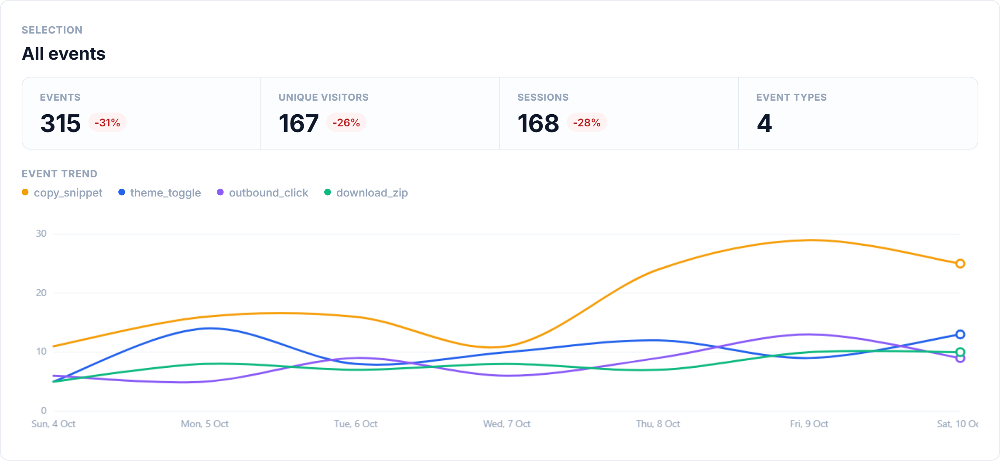
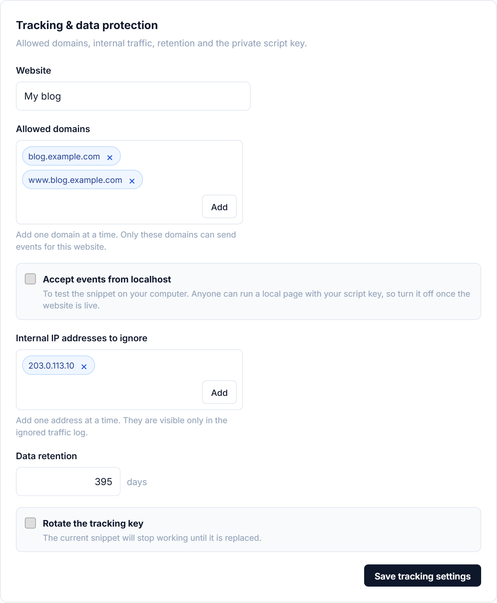

# Tracking

To start collecting visits, add your website in the dashboard with **Add New Website**, then copy the tracking snippet it gives you. It looks like this.

```html
<script
  defer
  src="https://analytics.example.com/minilytics.js"
  data-site-id="my_site"
  data-site-key="your-private-key"
  data-privacy-mode="strict"
></script>
```

Paste it in the `<head>` of every page of your website. Minilytics then counts page views on its own, including on websites that change pages without reloading.

## Measure clicks and other actions

Page views are counted automatically. To also measure actions, such as sign-ups or clicks on a button, send events.

The simplest way is to add a `data-minilytics-event` attribute to the element. Minilytics sends the event each time it is clicked, along with any other `data-minilytics-…` attribute you add.

```html
<button data-minilytics-event="signup_button" data-minilytics-plan="pro">
  Sign up
</button>
```

From your own JavaScript, call `minilytics.track` with the name of the event and, if you want, some details.

```js
minilytics.track("signup", { plan: "pro" });
```

Your events then appear on the **Events** page of the dashboard.



## When nothing shows up

First, check that your website's domain is listed in **Settings → Tracking → Allowed domains**. Minilytics ignores visits coming from any other domain.



To try the snippet on your own computer, turn on **Accept events from localhost** in the same place. Turn it off once your website is live, since anyone can then send data from their own computer.

If visits still do not arrive, add `data-debug="true"` to the snippet. Minilytics then explains in the browser console what it sends and what goes wrong. Remove it once everything works.

```html
<script
  defer
  src="https://analytics.example.com/minilytics.js"
  data-site-id="my_site"
  data-site-key="your-private-key"
  data-privacy-mode="strict"
  data-debug="true"
></script>
```
